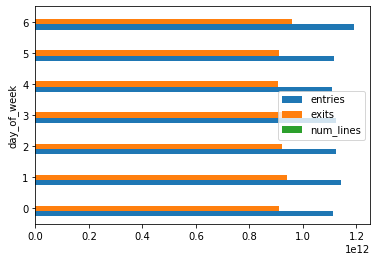
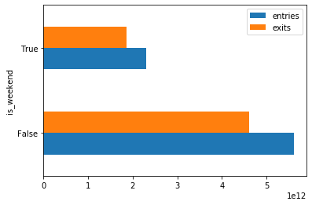

# Understanding Pandas Series and DataFrames - Lab

## Introduction

In this lab, let's get some hands-on practice working with data cleanup using Pandas.

## Objectives
You will be able to:

- Use the `.map()` and `.apply()` methods to apply a function to a pandas Series or DataFrame 
- Perform operations to change the structure of pandas DataFrames 
- Change the index of a pandas DataFrame 
- Change data types of columns in pandas DataFrames 

## Let's get started! 

Import the file `'turnstile_180901.txt'`. 


```python
# Import the required libraries
import pandas as pd
import matplotlib.pyplot as plt
%matplotlib inline
```


```python
# Import the file 'turnstile_180901.txt'
df = pd.read_csv('turnstile_180901.txt')

# Print the number of rows ans columns in df
print(df.shape)

# Print the first five rows of df
df.head()
```

    (197625, 11)


<div>
<style scoped>
    .dataframe tbody tr th:only-of-type {
        vertical-align: middle;
    }

    .dataframe tbody tr th {
        vertical-align: top;
    }

    .dataframe thead th {
        text-align: right;
    }
</style>
<table border="1" class="dataframe">
  <thead>
    <tr style="text-align: right;">
      <th></th>
      <th>C/A</th>
      <th>UNIT</th>
      <th>SCP</th>
      <th>STATION</th>
      <th>LINENAME</th>
      <th>DIVISION</th>
      <th>DATE</th>
      <th>TIME</th>
      <th>DESC</th>
      <th>ENTRIES</th>
      <th>EXITS</th>
    </tr>
  </thead>
  <tbody>
    <tr>
      <th>0</th>
      <td>A002</td>
      <td>R051</td>
      <td>02-00-00</td>
      <td>59 ST</td>
      <td>NQR456W</td>
      <td>BMT</td>
      <td>08/25/2018</td>
      <td>00:00:00</td>
      <td>REGULAR</td>
      <td>6736067</td>
      <td>2283184</td>
    </tr>
    <tr>
      <th>1</th>
      <td>A002</td>
      <td>R051</td>
      <td>02-00-00</td>
      <td>59 ST</td>
      <td>NQR456W</td>
      <td>BMT</td>
      <td>08/25/2018</td>
      <td>04:00:00</td>
      <td>REGULAR</td>
      <td>6736087</td>
      <td>2283188</td>
    </tr>
    <tr>
      <th>2</th>
      <td>A002</td>
      <td>R051</td>
      <td>02-00-00</td>
      <td>59 ST</td>
      <td>NQR456W</td>
      <td>BMT</td>
      <td>08/25/2018</td>
      <td>08:00:00</td>
      <td>REGULAR</td>
      <td>6736105</td>
      <td>2283229</td>
    </tr>
    <tr>
      <th>3</th>
      <td>A002</td>
      <td>R051</td>
      <td>02-00-00</td>
      <td>59 ST</td>
      <td>NQR456W</td>
      <td>BMT</td>
      <td>08/25/2018</td>
      <td>12:00:00</td>
      <td>REGULAR</td>
      <td>6736180</td>
      <td>2283314</td>
    </tr>
    <tr>
      <th>4</th>
      <td>A002</td>
      <td>R051</td>
      <td>02-00-00</td>
      <td>59 ST</td>
      <td>NQR456W</td>
      <td>BMT</td>
      <td>08/25/2018</td>
      <td>16:00:00</td>
      <td>REGULAR</td>
      <td>6736349</td>
      <td>2283384</td>
    </tr>
  </tbody>
</table>
</div>


Rename all the columns to lower case: 


```python
# Rename all the columns to lower case
df.columns = [col.lower() for col in df.columns]
```

Change the index to `'linename'`: 


```python
# Change the index to 'linename'
df = df.set_index('linename')
df.head()
```


<div>
<style scoped>
    .dataframe tbody tr th:only-of-type {
        vertical-align: middle;
    }

    .dataframe tbody tr th {
        vertical-align: top;
    }

    .dataframe thead th {
        text-align: right;
    }
</style>
<table border="1" class="dataframe">
  <thead>
    <tr style="text-align: right;">
      <th></th>
      <th>c/a</th>
      <th>unit</th>
      <th>scp</th>
      <th>station</th>
      <th>division</th>
      <th>date</th>
      <th>time</th>
      <th>desc</th>
      <th>entries</th>
      <th>exits</th>
    </tr>
    <tr>
      <th>linename</th>
      <th></th>
      <th></th>
      <th></th>
      <th></th>
      <th></th>
      <th></th>
      <th></th>
      <th></th>
      <th></th>
      <th></th>
    </tr>
  </thead>
  <tbody>
    <tr>
      <th>NQR456W</th>
      <td>A002</td>
      <td>R051</td>
      <td>02-00-00</td>
      <td>59 ST</td>
      <td>BMT</td>
      <td>08/25/2018</td>
      <td>00:00:00</td>
      <td>REGULAR</td>
      <td>6736067</td>
      <td>2283184</td>
    </tr>
    <tr>
      <th>NQR456W</th>
      <td>A002</td>
      <td>R051</td>
      <td>02-00-00</td>
      <td>59 ST</td>
      <td>BMT</td>
      <td>08/25/2018</td>
      <td>04:00:00</td>
      <td>REGULAR</td>
      <td>6736087</td>
      <td>2283188</td>
    </tr>
    <tr>
      <th>NQR456W</th>
      <td>A002</td>
      <td>R051</td>
      <td>02-00-00</td>
      <td>59 ST</td>
      <td>BMT</td>
      <td>08/25/2018</td>
      <td>08:00:00</td>
      <td>REGULAR</td>
      <td>6736105</td>
      <td>2283229</td>
    </tr>
    <tr>
      <th>NQR456W</th>
      <td>A002</td>
      <td>R051</td>
      <td>02-00-00</td>
      <td>59 ST</td>
      <td>BMT</td>
      <td>08/25/2018</td>
      <td>12:00:00</td>
      <td>REGULAR</td>
      <td>6736180</td>
      <td>2283314</td>
    </tr>
    <tr>
      <th>NQR456W</th>
      <td>A002</td>
      <td>R051</td>
      <td>02-00-00</td>
      <td>59 ST</td>
      <td>BMT</td>
      <td>08/25/2018</td>
      <td>16:00:00</td>
      <td>REGULAR</td>
      <td>6736349</td>
      <td>2283384</td>
    </tr>
  </tbody>
</table>
</div>


Remove the index: 


```python
# Remove the index
df = df.reset_index() 
df.head()
```


<div>
<style scoped>
    .dataframe tbody tr th:only-of-type {
        vertical-align: middle;
    }

    .dataframe tbody tr th {
        vertical-align: top;
    }

    .dataframe thead th {
        text-align: right;
    }
</style>
<table border="1" class="dataframe">
  <thead>
    <tr style="text-align: right;">
      <th></th>
      <th>linename</th>
      <th>c/a</th>
      <th>unit</th>
      <th>scp</th>
      <th>station</th>
      <th>division</th>
      <th>date</th>
      <th>time</th>
      <th>desc</th>
      <th>entries</th>
      <th>exits</th>
    </tr>
  </thead>
  <tbody>
    <tr>
      <th>0</th>
      <td>NQR456W</td>
      <td>A002</td>
      <td>R051</td>
      <td>02-00-00</td>
      <td>59 ST</td>
      <td>BMT</td>
      <td>08/25/2018</td>
      <td>00:00:00</td>
      <td>REGULAR</td>
      <td>6736067</td>
      <td>2283184</td>
    </tr>
    <tr>
      <th>1</th>
      <td>NQR456W</td>
      <td>A002</td>
      <td>R051</td>
      <td>02-00-00</td>
      <td>59 ST</td>
      <td>BMT</td>
      <td>08/25/2018</td>
      <td>04:00:00</td>
      <td>REGULAR</td>
      <td>6736087</td>
      <td>2283188</td>
    </tr>
    <tr>
      <th>2</th>
      <td>NQR456W</td>
      <td>A002</td>
      <td>R051</td>
      <td>02-00-00</td>
      <td>59 ST</td>
      <td>BMT</td>
      <td>08/25/2018</td>
      <td>08:00:00</td>
      <td>REGULAR</td>
      <td>6736105</td>
      <td>2283229</td>
    </tr>
    <tr>
      <th>3</th>
      <td>NQR456W</td>
      <td>A002</td>
      <td>R051</td>
      <td>02-00-00</td>
      <td>59 ST</td>
      <td>BMT</td>
      <td>08/25/2018</td>
      <td>12:00:00</td>
      <td>REGULAR</td>
      <td>6736180</td>
      <td>2283314</td>
    </tr>
    <tr>
      <th>4</th>
      <td>NQR456W</td>
      <td>A002</td>
      <td>R051</td>
      <td>02-00-00</td>
      <td>59 ST</td>
      <td>BMT</td>
      <td>08/25/2018</td>
      <td>16:00:00</td>
      <td>REGULAR</td>
      <td>6736349</td>
      <td>2283384</td>
    </tr>
  </tbody>
</table>
</div>


Create another column `'Num_Lines'` that is a count of how many lines pass through a station. Then sort your DataFrame by this column in descending order. 

*Hint: According to the [data dictionary](http://web.mta.info/developers/resources/nyct/turnstile/ts_Field_Description.txt), LINENAME represents all train lines that can be boarded at a given station. Normally lines are represented by one character. For example, LINENAME 456NQR represents trains 4, 5, 6, N, Q, and R.*


```python
# Add a new 'num_lines' column
df['num_lines'] = df['linename'].map(lambda x: len(x))
```

Write a function to clean column names: 


```python
def clean(col_name):
    # Clean the column name in any way you want to. Hint: think back to str methods 
    cleaned = col_name.strip()
    return cleaned
```


```python
# Use the above function to clean the column names
df.columns = [clean(col) for col in df.columns] 
```


```python
# Check to ensure the column names were cleaned
df.columns
```


    Index(['linename', 'c/a', 'unit', 'scp', 'station', 'division', 'date', 'time',
           'desc', 'entries', 'exits', 'num_lines'],
          dtype='object')


- Change the data type of the `'date'` column to a date 
- Add a new column `'day_of_week'` that represents the day of the week


```python
# Convert the data type of the 'date' column to a date
df['date'] = pd.to_datetime(df['date'])

# Add a new column 'day_of_week' that represents the day of the week 
df['day_of_week'] = df['date'].dt.dayofweek
```


```python
# Group the data by day of week and plot the sum of the numeric columns
grouped = df.groupby('day_of_week').sum()
grouped.plot(kind='barh')
plt.show()
```





- Remove the index of `grouped` 
- Print the first five rows of `grouped` 


```python
# Reset the index of grouped
grouped = grouped.reset_index()

# Print the first five rows of grouped
grouped.head()
```


<div>
<style scoped>
    .dataframe tbody tr th:only-of-type {
        vertical-align: middle;
    }

    .dataframe tbody tr th {
        vertical-align: top;
    }

    .dataframe thead th {
        text-align: right;
    }
</style>
<table border="1" class="dataframe">
  <thead>
    <tr style="text-align: right;">
      <th></th>
      <th>day_of_week</th>
      <th>entries</th>
      <th>exits</th>
      <th>num_lines</th>
    </tr>
  </thead>
  <tbody>
    <tr>
      <th>0</th>
      <td>0</td>
      <td>1114237052454</td>
      <td>911938153513</td>
      <td>76110</td>
    </tr>
    <tr>
      <th>1</th>
      <td>1</td>
      <td>1143313287046</td>
      <td>942230721477</td>
      <td>77303</td>
    </tr>
    <tr>
      <th>2</th>
      <td>2</td>
      <td>1123655222441</td>
      <td>920630864687</td>
      <td>75713</td>
    </tr>
    <tr>
      <th>3</th>
      <td>3</td>
      <td>1122723988662</td>
      <td>920691927110</td>
      <td>76607</td>
    </tr>
    <tr>
      <th>4</th>
      <td>4</td>
      <td>1110224700078</td>
      <td>906799065337</td>
      <td>75573</td>
    </tr>
  </tbody>
</table>
</div>


Add a new column `'is_weekend'` that maps the `'day_of_week'` column using the dictionary `weekend_map` 


```python
# Use this dictionary to create a new column 
weekend_map = {0:False, 1:False, 2:False, 3:False, 4:False, 5:True, 6:True}

# Add a new column 'is_weekend' that maps the 'day_of_week' column using weekend_map
grouped['is_weekend'] = grouped['day_of_week'].map(weekend_map)
```


```python
# Group the data by weekend/weekday and plot the sum of the numeric columns
wkend = grouped.groupby('is_weekend').sum()
wkend[['entries', 'exits']].plot(kind='barh')
plt.show()
```





Remove the `'c/a'` and `'scp'` columns. 


```python
# Remove the 'c/a' and 'scp' columns
df = df.drop(['c/a', 'scp'], axis=1)
df.head(2)
```


<div>
<style scoped>
    .dataframe tbody tr th:only-of-type {
        vertical-align: middle;
    }

    .dataframe tbody tr th {
        vertical-align: top;
    }

    .dataframe thead th {
        text-align: right;
    }
</style>
<table border="1" class="dataframe">
  <thead>
    <tr style="text-align: right;">
      <th></th>
      <th>linename</th>
      <th>unit</th>
      <th>station</th>
      <th>division</th>
      <th>date</th>
      <th>time</th>
      <th>desc</th>
      <th>entries</th>
      <th>exits</th>
      <th>num_lines</th>
      <th>day_of_week</th>
    </tr>
  </thead>
  <tbody>
    <tr>
      <th>0</th>
      <td>NQR456W</td>
      <td>R051</td>
      <td>59 ST</td>
      <td>BMT</td>
      <td>2018-08-25</td>
      <td>00:00:00</td>
      <td>REGULAR</td>
      <td>6736067</td>
      <td>2283184</td>
      <td>7</td>
      <td>5</td>
    </tr>
    <tr>
      <th>1</th>
      <td>NQR456W</td>
      <td>R051</td>
      <td>59 ST</td>
      <td>BMT</td>
      <td>2018-08-25</td>
      <td>04:00:00</td>
      <td>REGULAR</td>
      <td>6736087</td>
      <td>2283188</td>
      <td>7</td>
      <td>5</td>
    </tr>
  </tbody>
</table>
</div>


## Analysis Question 

What is misleading about the day of week and weekend/weekday charts you just plotted?


```python
# Answer: The raw data for entries/exits is cumulative. 
# As such, you would first need to order the data by time and station, 
# and then calculate the difference in order to produce meaningful aggregations.
```

## Summary

Great! You practiced your data cleanup skills using Pandas.
